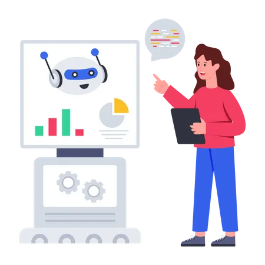

<h1 align="center">Hi 👋, I'm Anusha Mandaddi </h1>
<h3 align="center">Data Enthusiast | Analytical Thinker | Insightful Solutions for Data-Driven Success</h3>

<h1 align="center">
 
</h1>

# Machine_Learning-Projects
Welcome to my Machine Learning repository! Here, you'll find a collection of my ML projects, each designed to help you sharpen your skills and showcase your work in this exciting field. Whether you're just starting out or have experience in data and machine learning, this repository offers something for everyone.

These projects cover a range of techniques and concepts, including classification, regression, natural language processing, and computer vision. Each project has been carefully curated to help you gain hands-on experience with different machine learning algorithms, solve real-world problems, and deepen your understanding of data.

As you explore, you'll discover how data can be transformed into actionable insights and how ML models can provide solutions to complex challenges. My goal is to continue learning, experimenting, and sharing with the community to further improve my skills and contribute to the ever-growing field of data.

Thanks for visiting! Let's learn and grow together.

